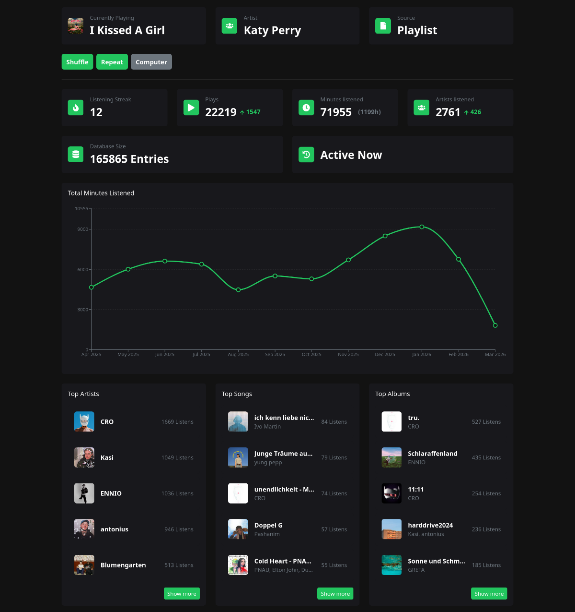
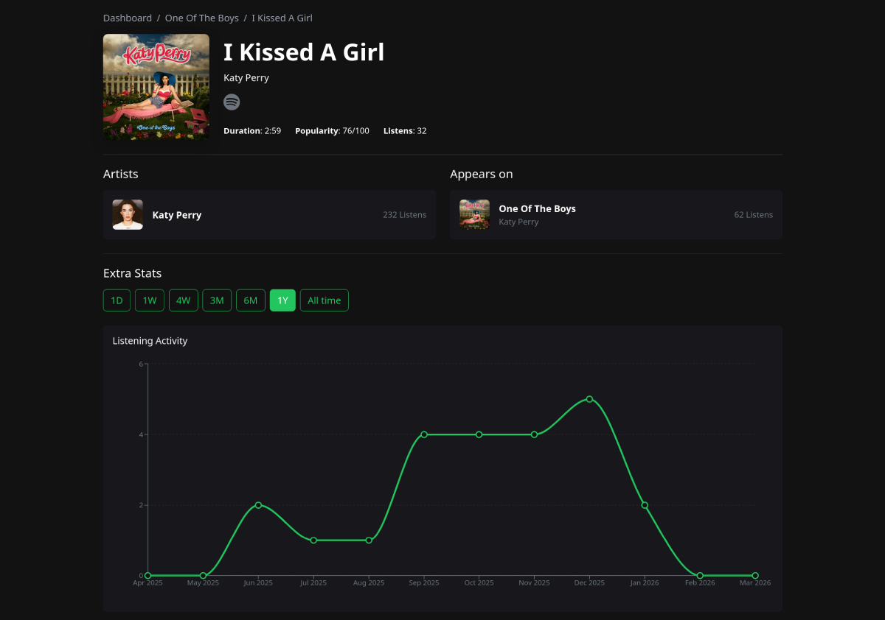
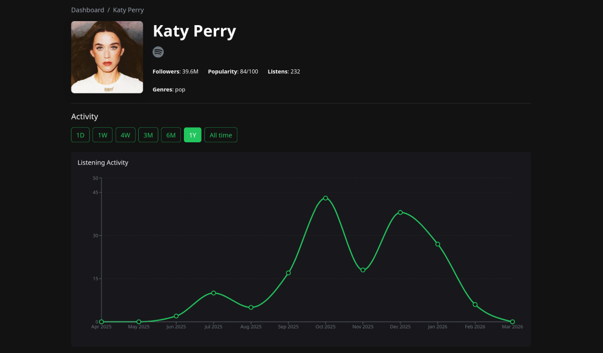
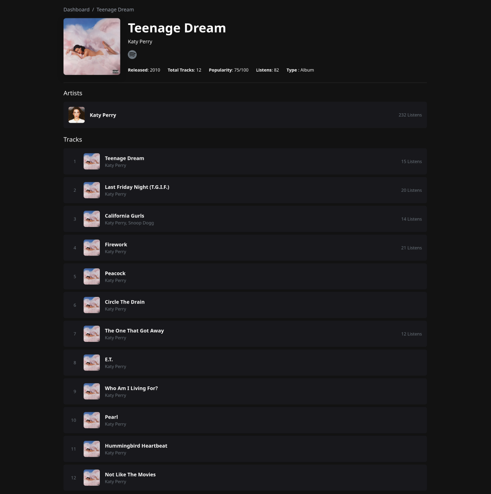
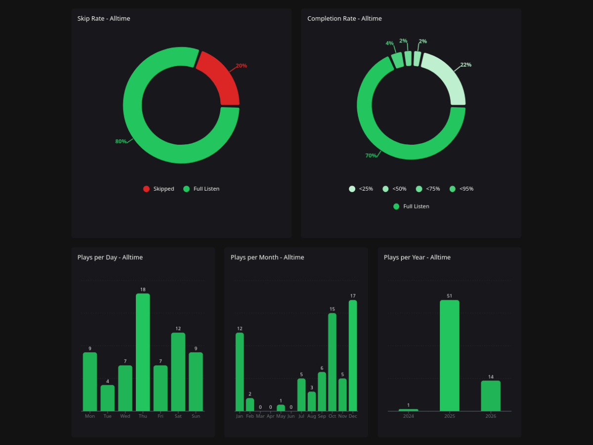

<div align="center">

[](https://react.dev/)
[](https://www.typescriptlang.org/)
[](https://fastapi.tiangolo.com/)
[](https://www.python.org/)
[](https://opensource.org/licenses/MIT)
[](https://github.com/nilsgenge/spotihost/stargazers)

</div>

# SpotiHost

> A self-hosted analytics tool for Spotify

Import your entire Spotify listening history and analyze it locally. SpotiHost tracks plays, skips and listening patterns with time-series charts. It runs in the background via docker, automatically fetching new listens in addition to your imports.

<details>
<summary><strong>Recent Changes</strong></summary>

- **2026-03-08:** Updated Readme
- **2026-03-08:** Added welcome page and logout button
- **2026-03-07:** Added platform and context piecharts
- **2026-03-07:** Added option to choose ports in docker config
- **2026-02-25:** Implmement seperate docker config for developement
- **2026-02-24:** Layout improvements to all pages
- **2026-02-01:** Added Diagrams to track/artist/album pages

<details>
<summary><strong>Expand further</strong></summary>

- **2026-01-27:** Added settings page
- **2026-01-27:** Added option to upload listening history
- **2026-01-21:** Added health check for db and backend connection
- **2026-01-11:** Added dedicated track/album/artist pages
- **2026-01-08:** Started using alembic for db version management
- **2026-01-08:** Added top ranking page

</details>
</details>
<br>

**Table of Contents**

- [Key Features](#features)
- [Screenshots](#screenshots)
- [Getting Started](#getting-started)
  - [Quick Start with Docker](#quick-start-with-docker)
  - [Development Mode](#development-mode)
- [Contributing](#contributing)

## Features

- Docker Deployment: Run the full application stack effortlessly with just a few commands.
- Spotify Integration: Log in with your Spotify account to get started immediately.
- Automatic Syncing: Runs in the background to fetch and update your latest listens automatically.
- Full History Import: Import your entire Spotify library to analyze lifetime statistics, not just recent data.
- Detailed Metrics: Analyze skip rates and track completion percentages for songs, albums, and artists.
- Interactive Charts: Visualize trends with line charts tracking minutes and plays over any time range.
- Dynamic Rankings: View your top artists, albums, and tracks filtered by specific date ranges.
- Listening History: Access a complete, searchable log of every song you have ever played.

## Screenshots

<table width="100%">
  <tr>
    <td align="center">
      
      <br>
      <em> Dashboard with quick stats, top artists/albums/tracks, and recent listens.</em>
    </td>
  </tr>
  <tr>
    <td align="center">
      
      <br>
      <em> Detailed stats for a single track: play counts, skips, completion rate.</em>
    </td>
  </tr>
  <tr>
    <td align="center">
      
      <br>
      <em> Artist overview with total plays, top albums, and listening timeline.</em>
    </td>
  </tr>
  <tr>
    <td align="center">
      
      <br>
      <em> Album statistics including track breakdown and play distribution.</em>
    </td>
  </tr>
  <tr>
    <td align="center">
      
      <br>
      <em> Charts for plays, minutes, skip rate, listening platform, context.</em>
    </td>
  </tr>
</table>

## Getting Started

### Quick Start with Docker

SpotiHost uses a pre-built Docker image by default. Just clone the repo for configuration files and start the app.

**Prerequisites**

- Docker and Docker Compose installed
- Spotify Developer Account

**Get Spotify Credentials**

1. Go to [Spotify Developer Dashboard](https://developer.spotify.com/dashboard)
2. Click "Create App"
3. Fill in app name and description
4. In the app settings, add a Redirect URL:
   - For local use: `http://127.0.0.1:8000/callback`
   - For deployment on a server: `https://your-domain.com/callback`
5. Copy the **Client ID** and **Client Secret**

**Configure Environment**

```bash
# Clone the repository
git clone https://github.com/nilsgenge/spotihost.git
cd spotihost

# Create your config file
cp .env.example .env
```

Edit `.env` with your credentials:

```env
# Database Configuration
DB_USER=spotihost_user
DB_PASSWORD=your_secure_password_here
DB_NAME=spotihost_db
DB_PORT=5432

# Spotify API Credentials
SPOTIFY_CLIENT_ID=your_spotify_client_id_here
SPOTIFY_CLIENT_SECRET=your_spotify_client_secret_here

# Application Settings
PORT=8000
SPOTIFY_REDIRECT_URI=http://127.0.0.1:8000/callback
```

**Start the Application**

```bash
# Start
docker compose up -d

# Stop the application
docker compose down
```

**Access SpotiHost**

Open your browser and go to: **http://localhost:8000** or configure your own domain.

**Updating**

```bash
# Pull the latest image and restart
docker compose pull nilsgenge/spotihost
docker compose up -d
```

### Development Mode

For local development with hot reload and seperate frontend container:

```bash
# Clone the repository
git clone https://github.com/nilsgenge/spotihost.git
cd spotihost

# Create your config file
cp .env.example .env
# Edit .env with your credentials

# Start in development mode (builds from source)
docker compose -f docker-compose.yml -f docker-compose.dev.yml up -d --build
```

**Updating in dev mode**

```bash
git pull
docker compose -f docker-compose.yml -f docker-compose.dev.yml up -d --build
```

## Troubleshooting

**Reset Everything (Fresh Start)**

```bash
# Warning: This deletes all your data!
docker compose down -v
docker compose up -d
```

## Contributing

I appreciate any contributions you this project! Whether you’re reporting a bug, suggesting a new feature, or submitting a pull request. Your input helps shape the project and makes it better for everyone.
Don’t hesitate to open an issue or share your ideas.
