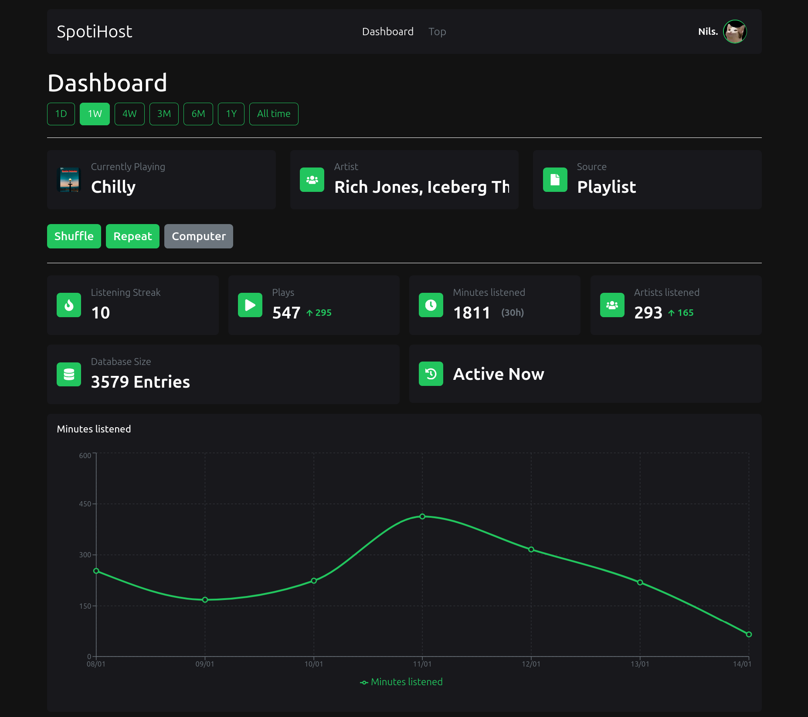
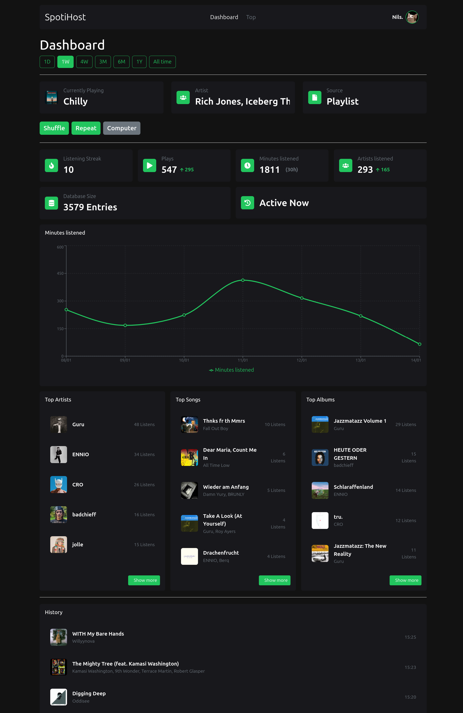
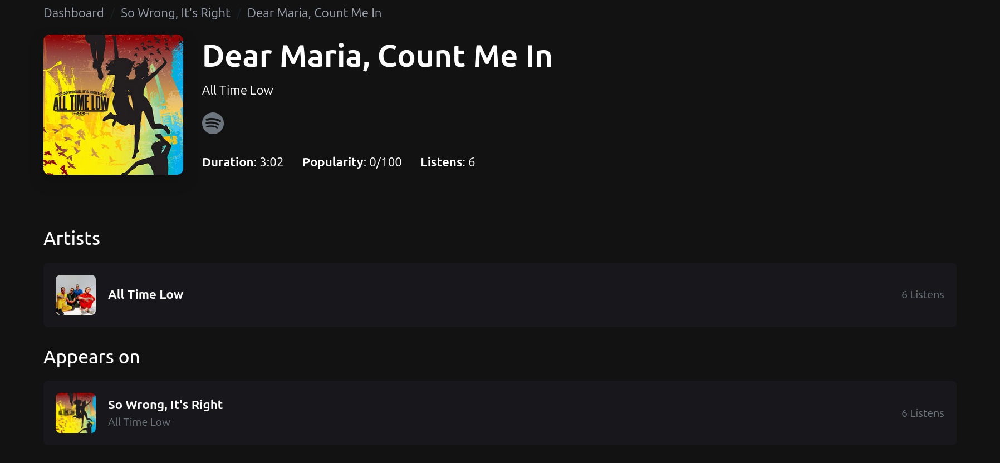
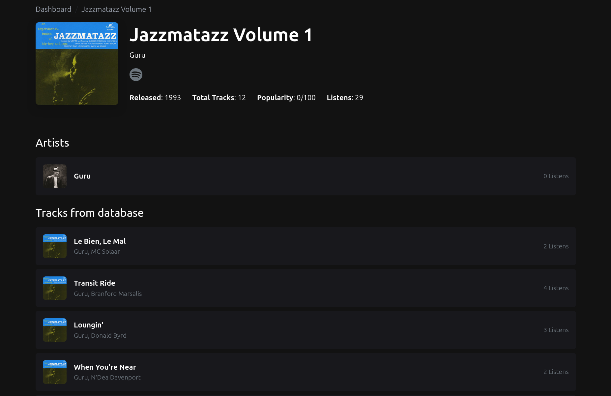

# SpotiHost

A selfhosted analysics tool for Spotify

## Overview
SpotiHost is a selfhostable service that analysis all your spotify listens and provides insights into your listening habits.

## Features

- **Spotify API** Integration: Login with your Spotify account and SpotiHost automatically fetches all your future listens without you even noticing.  
- **Docker**: the entire application runs in a few commands on your server

## Screenshots

  

 

  

 

  

## Tech Stack
**Frontend:** React, TypeScript

**Backend:** Python, FastAPI, PostgreSQL

## Quick Start
Coming soon...
